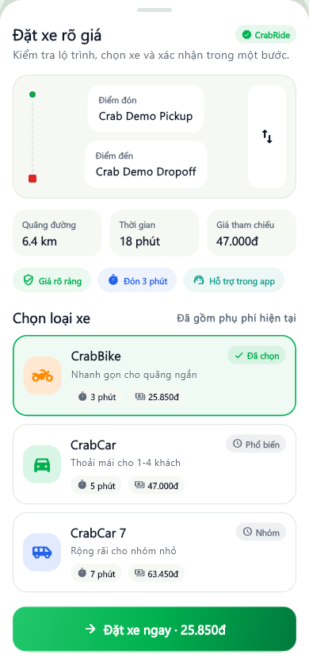
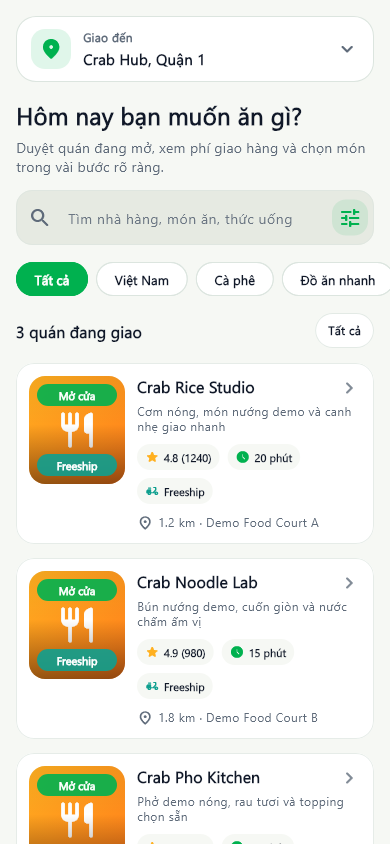
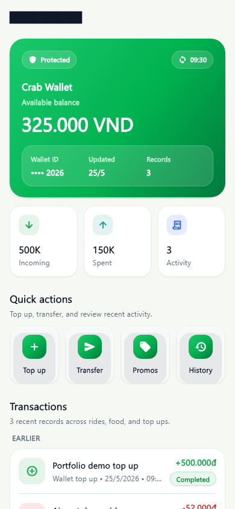
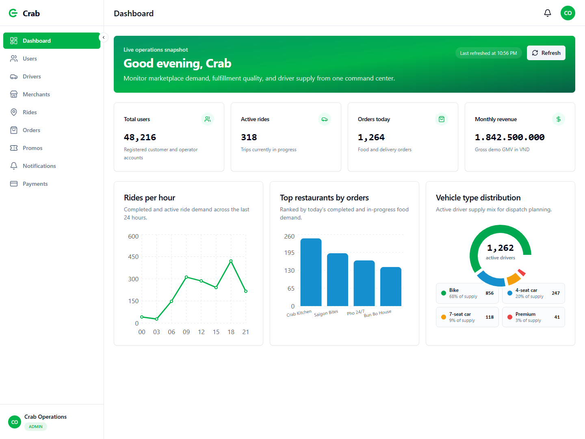
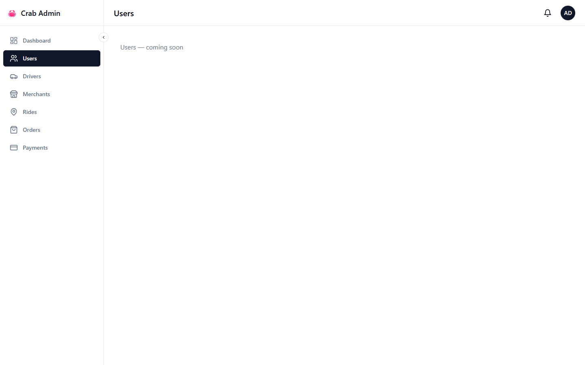
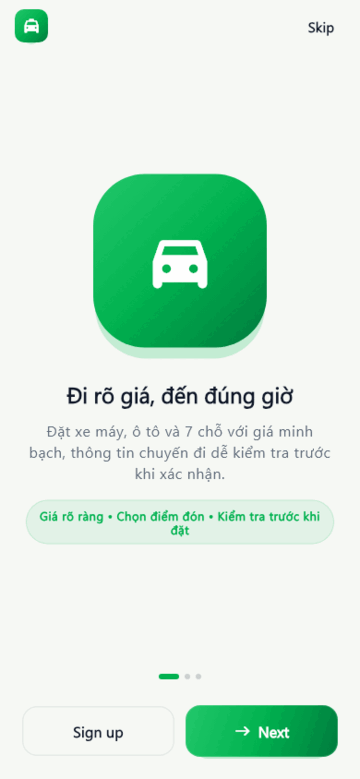
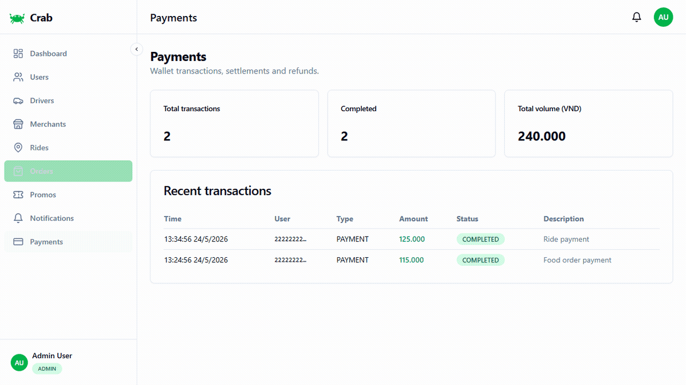
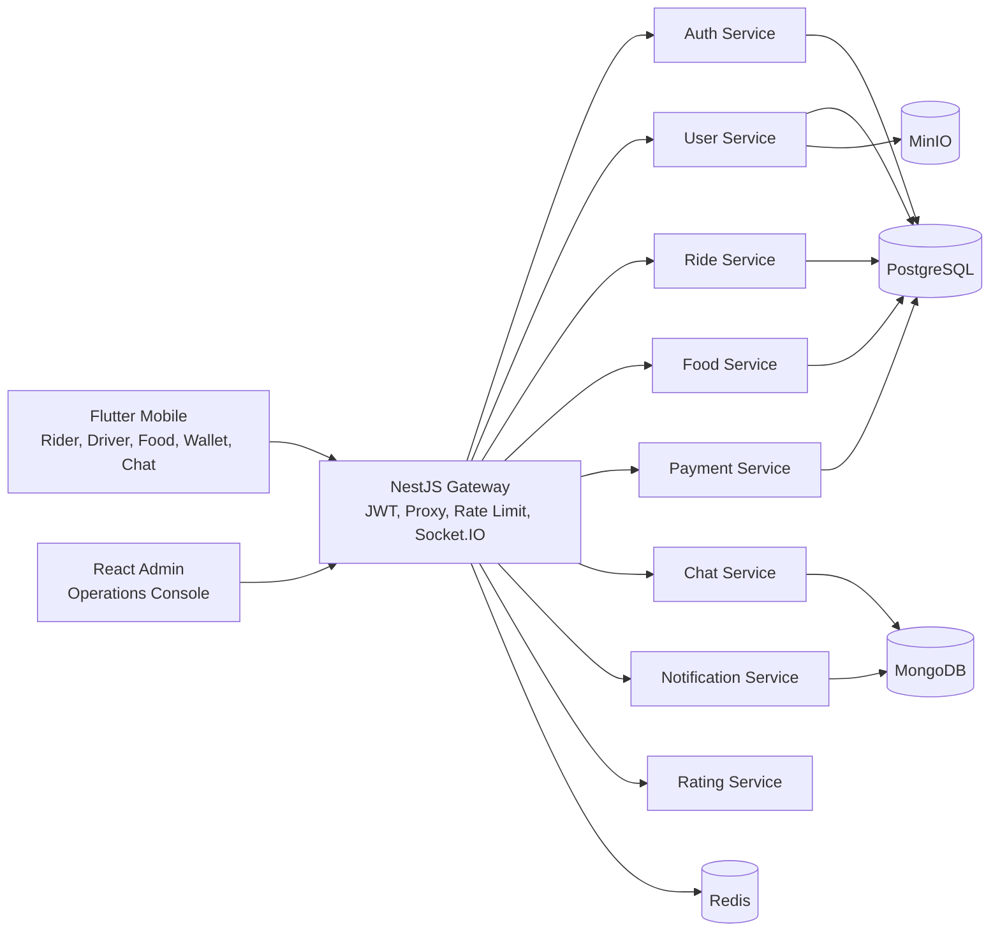

# Crab Super App Portfolio Case Study

This document is intentionally split into two complete reading tracks. The
English case study comes first. The Vietnamese case study follows as a separate
section with the same core evidence, so readers do not have to parse mixed
English/Vietnamese paragraphs or tables.

- [English Case Study](#english-case-study)
- [Vietnamese Case Study](#vietnamese-case-study)

---

<!-- CASE-STUDY-EN:START -->

## English Case Study

### Executive Summary

Crab is a production-like full-stack portfolio project for a Vietnam-first
super app: ride-hailing, food delivery, wallet, chat, notifications, ratings,
and admin operations in one monorepo.

| Area | Portfolio evidence |
| --- | --- |
| Product | Flutter consumer app and React operations admin |
| Backend | NestJS microservices behind a Gateway with REST and Socket.IO |
| Data | PostgreSQL, MongoDB, Redis, and MinIO |
| Delivery | Local Docker production-like demo, CI, scanners, SBOM-ready release flow |
| Proof | Real screenshots, GIF walkthroughs, E2E checks, load tests, security audit |

The scope is a local production-like portfolio demo, not a real public cloud
launch. Real SMS, real payment gateways, real FCM, app store release, and
public cloud URLs are outside the current portfolio boundary.

### Product Positioning

Crab takes the familiar daily-utility pattern of apps like Grab and Be as a
category reference while keeping its own implementation, visual language, and
brand assets. The app focuses on quick operational decisions: book a ride,
order food, check wallet trust signals, chat with a driver, receive
notifications, and rate completed work.

### Brand Identity

The public brand asset is [`docs/assets/crab-logo.svg`](assets/crab-logo.svg).
It uses an original Crab `C` monogram, a green mobility/commerce palette, and
rounded geometry that fits the friendly daily-utility category without copying
Grab or Be brand assets.

### First-Look Gallery

| Mobile Home | Ride Booking | Food Discovery |
| --- | --- | --- |
|  |  |  |

| Wallet/Profile Trust | Admin Dashboard | Admin Users |
| --- | --- | --- |
|  |  |  |

| Mobile Walkthrough | Admin Walkthrough |
| --- | --- |
|  |  |

### Architecture



- The Gateway is the only public API surface for the production-like local demo.
- Services own their domain data and expose health checks for Docker readiness.
- REST handles command/query flows.
- Socket.IO covers realtime ride, food, chat, and notification channels.
- Shared packages keep DTO and event contracts consistent across apps and services.

### Feature Matrix

| Domain | Capability | Proof |
| --- | --- | --- |
| Auth | Seeded admin, rider, driver, merchant login | `pnpm run test:e2e` |
| Ride | Fare estimate, request, driver accept, active ride, lifecycle, history | `test:e2e`, `tests/load/ride-flow.js` |
| Food | Restaurant discovery, menu, order creation, status progression, stats | `test:e2e`, `tests/load/order-flow.js` |
| Wallet | Balance, top-up, transactions | `test:e2e` |
| Chat | Room creation, message send/list, read state | `test:e2e` |
| Notifications | Create, list, unread count, mark read, mark all read | `test:e2e` |
| Ratings | Create rating, reference lookup, aggregate, rater lookup | `test:e2e` |
| Admin | Dashboard and operations tables for users, drivers, rides, orders | Screenshots and web build |

### Local Demo Path

```bash
corepack enable
pnpm install --frozen-lockfile
docker compose --env-file .env.production.example -f docker-compose.prod.yml up -d
pnpm run db:migrate
pnpm run db:seed
pnpm run test:e2e
pnpm run test:load
pnpm run verify:portfolio
```

Demo accounts:

| Role | Email | Password |
| --- | --- | --- |
| Admin | `admin@crab.app` | `Admin123!` |
| Rider | `rider@crab.app` | `User123!` |
| Driver | `driver@crab.app` | `Driver123!` |
| Merchant | `merchant@crab.app` | `User123!` |

Use these accounts only with seeded local/demo data. Do not use real customer
information, real payment data, or real provider credentials in portfolio
screenshots.

### Public Artifact Strategy

- Source packages stay private because this is an application monorepo, not a
  reusable npm or pub.dev library.
- Docker Hub remains the canonical external runtime registry:
  `nguyenson1710/crab-mobile-<service>`.
- GitHub Packages is populated through GHCR for portfolio visibility:
  `ghcr.io/jasontm17/crab-mobile-<service>`.
- GitHub Releases carry semantic release notes and source snapshots.
- Mobile APK/AAB/IPA outputs are generated locally or in release pipelines and
  are never committed to the repository.

### Validation Evidence

| Gate | Status | What it proves |
| --- | --- | --- |
| `pnpm run package:check` | Pass | Package metadata, Docker namespace, release-media, docs, and repo hygiene guardrails |
| `pnpm run contract:check` | Pass | REST/OpenAPI/shared contract drift guardrails |
| `pnpm run test:e2e` | Pass | Gateway-backed domain journey coverage |
| `pnpm run test:load` | Pass | k6 gateway baseline load check |
| `k6 run tests/load/ride-flow.js` | Pass | Ride path under local demo concurrency |
| `k6 run tests/load/order-flow.js` | Pass | Food order path under local demo concurrency |
| `pnpm run security:audit` | Pass | Dependency audit with no known vulnerabilities |
| `pnpm run verify:portfolio` | Pass | Package, contract, admin build, mobile analyze/test, Docker config |

The E2E suite validates gateway health, all seeded role logins,
protected-route rejection, rider profile and addresses, wallet top-up and
transaction history, food order lifecycle, ride lifecycle, ratings,
notifications, and chat.

### Repository Self-Review Scorecard

Overall score: **90 / 100**.

This score is a portfolio-readiness review, not a formal production compliance
audit. It is based on current repository evidence, repeatable commands, release
media, and documented scope boundaries.

| Category | Score | Evidence | Gap | Next improvement |
| --- | ---: | --- | --- | --- |
| Documentation and portfolio presentation | 19 / 20 | Separate language tracks in README, case study, docs index, screenshots gallery | Some older domain docs are still mostly English | Gradually split core domain docs into dedicated language tracks |
| Mobile UI/UX and release media | 13 / 15 | Flutter screenshots, mobile GIF, UI/UX redesign guide, screenshot tests | Not a real app-store build/release | Add signed release artifacts and physical-device captures for a real release track |
| Backend architecture and API contracts | 14 / 15 | Gateway, NestJS services, OpenAPI, contract checks, service docs | Some provider integrations are demo/local only | Add real provider adapters behind explicit environment flags |
| E2E, load, and mobile validation | 19 / 20 | `test:e2e`, k6 baseline, ride/order load flows, `verify:portfolio`, Flutter analyze/test | Load profile is local-demo sized | Add a separate stress profile with throttling and infra expectations |
| Security posture | 8 / 10 | `security:audit`, Gitleaks, CodeQL, Trivy, secret hygiene, gateway auth guardrails | No external penetration test | Add threat-model report snapshots |
| DevOps and release readiness | 9 / 10 | Docker Compose prod config, image namespace guardrails, CI/CD docs, release checklist | No public cloud deployment target in scope | Add optional Render/VPS/K8s deployment walkthrough with sanitized secrets |
| Git and repo hygiene | 8 / 10 | Monorepo structure, package guardrails, root junk guardrail, documented scripts | Portfolio pass involved large changesets | Keep future work on smaller feature branches and focused commits |

### UI/UX Direction

- Mobile should feel energetic and trustworthy, with green as the brand anchor,
  amber for rewards/promos, and restrained blue/teal for trust/status moments.
- Admin should stay dense, calm, and operations-focused: tables, filters,
  status tags, and repeatable workflows matter more than marketing visuals.
- Screenshots must show populated success states, not placeholder loading
  screens or debug artifacts.

### Interview Talking Points

- Why the Gateway owns public entry while services keep domain boundaries.
- How seeded demo data makes portfolio validation repeatable.
- Why local Docker was chosen over a public cloud requirement for this portfolio.
- How contract checks and E2E tests prevent docs from becoming marketing claims.
- What would change for a real launch: real providers, observability dashboards,
  secret management, incident process, app-store signing, and cloud deployment.

### Current Portfolio Boundaries

In scope:

- Full-stack local demo.
- Flutter client surfaces and release media.
- React admin operations dashboard.
- NestJS Gateway and backend services.
- Docker Compose production-like configuration.
- Repeatable validation, E2E, load, and security audit commands.

Out of scope:

- Real SMS/OTP provider.
- Real payment gateway settlement.
- Real FCM production push.
- Public cloud URL.
- App Store or Play Store release.
- Compliance certification.

<!-- CASE-STUDY-EN:END -->

---

<!-- CASE-STUDY-VI:START -->

## Vietnamese Case Study

### Tóm Tắt Điều Hành

Crab là dự án portfolio full-stack theo hướng production-like cho một super app
ưu tiên bối cảnh Việt Nam: gọi xe, giao đồ ăn, ví, chat, thông báo, đánh giá và
vận hành admin trong một monorepo.

| Khu vực | Bằng chứng portfolio |
| --- | --- |
| Sản phẩm | Ứng dụng Flutter cho người dùng và React admin vận hành |
| Backend | NestJS microservices phía sau Gateway, dùng REST và Socket.IO |
| Data | PostgreSQL, MongoDB, Redis và MinIO |
| Delivery | Demo local Docker theo hướng production-like, CI, scanner, release flow sẵn sàng SBOM |
| Bằng chứng | Screenshot thật, GIF walkthrough, E2E, load test, security audit |

Phạm vi hiện tại là demo portfolio production-like chạy local, không phải
launch cloud thật. SMS thật, cổng thanh toán thật, FCM thật, app store release
và URL cloud public không nằm trong phạm vi portfolio này.

### Định Vị Sản Phẩm

Crab lấy cảm hứng từ nhóm sản phẩm tiện ích hằng ngày như Grab và Be ở cấp độ
category, nhưng giữ implementation, visual language và brand assets riêng.
Trọng tâm trải nghiệm là ra quyết định nhanh: đặt xe, gọi món, kiểm tra ví,
chat với tài xế, nhận thông báo và đánh giá sau khi hoàn tất.

### Nhận Diện Thương Hiệu

Asset nhận diện public nằm tại [`docs/assets/crab-logo.svg`](assets/crab-logo.svg).
Logo dùng monogram `C` riêng của Crab, bảng màu xanh cho mobility/commerce và
hình khối bo nhẹ để hợp nhóm sản phẩm tiện ích hằng ngày nhưng không sao chép
asset thương hiệu của Grab hoặc Be.

### Gallery Nhìn Nhanh

| Mobile Home | Ride Booking | Food Discovery |
| --- | --- | --- |
|  |  |  |

| Wallet/Profile Trust | Admin Dashboard | Admin Users |
| --- | --- | --- |
|  |  |  |

| Mobile Walkthrough | Admin Walkthrough |
| --- | --- |
|  |  |

### Kiến Trúc


- Gateway là bề mặt API public duy nhất cho demo local production-like.
- Mỗi service sở hữu dữ liệu nghiệp vụ riêng và có health check cho Docker.
- REST xử lý command/query flows.
- Socket.IO xử lý realtime ride, food, chat và notification.
- Shared packages giữ DTO và event contract nhất quán giữa app và backend.

### Ma Trận Tính Năng

| Domain | Năng lực | Bằng chứng |
| --- | --- | --- |
| Auth | Login demo cho admin, rider, driver, merchant | `pnpm run test:e2e` |
| Ride | Ước tính giá, đặt xe, tài xế nhận, chuyến đang chạy, lifecycle, lịch sử | `test:e2e`, `tests/load/ride-flow.js` |
| Food | Tìm nhà hàng, menu, tạo order, chuyển trạng thái, thống kê | `test:e2e`, `tests/load/order-flow.js` |
| Wallet | Số dư, nạp ví, lịch sử giao dịch | `test:e2e` |
| Chat | Tạo phòng, gửi/list tin nhắn, trạng thái đã đọc | `test:e2e` |
| Notifications | Tạo, list, đếm chưa đọc, đánh dấu đã đọc, đánh dấu tất cả đã đọc | `test:e2e` |
| Ratings | Tạo rating, lookup theo reference, aggregate, lookup theo người đánh giá | `test:e2e` |
| Admin | Dashboard và bảng vận hành users, drivers, rides, orders | Screenshots và web build |

### Luồng Demo Local

```bash
corepack enable
pnpm install --frozen-lockfile
docker compose --env-file .env.production.example -f docker-compose.prod.yml up -d
pnpm run db:migrate
pnpm run db:seed
pnpm run test:e2e
pnpm run test:load
pnpm run verify:portfolio
```

Tài khoản demo:

| Role | Email | Password |
| --- | --- | --- |
| Admin | `admin@crab.app` | `Admin123!` |
| Rider | `rider@crab.app` | `User123!` |
| Driver | `driver@crab.app` | `Driver123!` |
| Merchant | `merchant@crab.app` | `User123!` |

Chỉ dùng các tài khoản này với dữ liệu local/demo đã seed. Không đưa thông tin
khách hàng thật, dữ liệu thanh toán thật hoặc provider credential thật vào
screenshot portfolio.

### Chiến Lược Artifact Public

- Source package giữ private vì đây là monorepo ứng dụng, không phải thư viện
  npm hoặc pub.dev để tái sử dụng public.
- Docker Hub là external runtime registry chính:
  `nguyenson1710/crab-mobile-<service>`.
- GitHub Packages được populate qua GHCR để portfolio hiển thị package ngay
  trên GitHub: `ghcr.io/jasontm17/crab-mobile-<service>`.
- GitHub Releases chứa release notes theo semver và source snapshot.
- APK/AAB/IPA mobile được tạo local hoặc trong release pipeline, không commit
  vào repository.

### Bằng Chứng Kiểm Chứng

| Gate | Status | Ý nghĩa |
| --- | --- | --- |
| `pnpm run package:check` | Pass | Guardrail package metadata, Docker namespace, release media, docs và repo hygiene |
| `pnpm run contract:check` | Pass | Guardrail chống drift REST/OpenAPI/shared contract |
| `pnpm run test:e2e` | Pass | Kiểm tra domain journey qua Gateway |
| `pnpm run test:load` | Pass | Load check baseline bằng k6 qua Gateway |
| `k6 run tests/load/ride-flow.js` | Pass | Luồng gọi xe dưới concurrency local demo |
| `k6 run tests/load/order-flow.js` | Pass | Luồng food order dưới concurrency local demo |
| `pnpm run security:audit` | Pass | Dependency audit không có known vulnerabilities |
| `pnpm run verify:portfolio` | Pass | Package, contract, admin build, mobile analyze/test, Docker config |

Bộ E2E kiểm tra gateway health, login đủ các role demo, chặn route cần auth khi
không có token, profile/address, top-up ví và transaction history, lifecycle
của food order, lifecycle của ride, rating, notification và chat.

### Bảng Tự Chấm Điểm Repo

Điểm tổng quan: **90 / 100**.

Điểm này là đánh giá mức sẵn sàng portfolio, không phải chứng nhận compliance
production chính thức. Điểm dựa trên bằng chứng trong repo, command có thể chạy
lặp lại, release media và phạm vi đã được tài liệu hóa.

| Hạng mục | Điểm | Bằng chứng | Khoảng trống | Cải thiện tiếp theo |
| --- | ---: | --- | --- | --- |
| Tài liệu và trình bày portfolio | 19 / 20 | README, case study, docs index và screenshot gallery đã tách riêng theo ngôn ngữ | Một số domain docs cũ vẫn chủ yếu là tiếng Anh | Dần tách core domain docs thành track ngôn ngữ riêng |
| UI/UX mobile và release media | 13 / 15 | Flutter screenshots, mobile GIF, UI/UX redesign guide, screenshot tests | Chưa phải app-store release thật | Thêm signed release artifacts và ảnh chụp thiết bị thật |
| Kiến trúc backend và API contract | 14 / 15 | Gateway, NestJS services, OpenAPI, contract checks, service docs | Một số provider integration chỉ ở mức demo/local | Thêm adapter provider thật sau explicit environment flags |
| E2E, load test và mobile validation | 19 / 20 | `test:e2e`, k6 baseline, ride/order load flows, `verify:portfolio`, Flutter analyze/test | Load profile ở mức local demo | Thêm stress profile riêng kèm kỳ vọng throttling/infra |
| Tư thế bảo mật | 8 / 10 | `security:audit`, Gitleaks, CodeQL, Trivy, secret hygiene, gateway auth guardrails | Chưa có external penetration test | Thêm snapshot threat-model report |
| DevOps và sẵn sàng release | 9 / 10 | Docker Compose prod config, image namespace guardrails, CI/CD docs, release checklist | Không có public cloud deployment trong scope | Thêm walkthrough Render/VPS/K8s optional với secret đã sanitize |
| Git và vệ sinh repo | 8 / 10 | Monorepo structure, package guardrails, root junk guardrail, documented scripts | Portfolio pass có changeset lớn | Giữ các thay đổi sau nhỏ hơn bằng feature branch và commit tập trung |

### Định Hướng UI/UX

- Mobile cần năng động nhưng đáng tin cậy: xanh làm màu nhận diện chính, amber
  cho reward/promo, blue/teal chỉ dùng cho trạng thái hoặc cảm giác tin cậy.
- Admin cần gọn, rõ và phục vụ vận hành: bảng dữ liệu, filter, status tag và
  workflow lặp lại quan trọng hơn hiệu ứng marketing.
- Screenshot public phải là trạng thái thành công có dữ liệu, không dùng loading
  placeholder hoặc debug artifact.

### Điểm Nói Khi Phỏng Vấn

- Vì sao Gateway là entry public, còn service giữ boundary nghiệp vụ riêng.
- Cách seed data giúp demo portfolio chạy lặp lại và kiểm chứng được.
- Vì sao portfolio chọn local Docker thay vì bắt buộc cloud public.
- Cách contract check và E2E test giúp docs không chỉ là lời quảng cáo.
- Nếu launch thật cần bổ sung gì: provider thật, observability dashboard, quản
  lý secret, incident process, ký app-store và cloud deployment.

### Ranh Giới Portfolio Hiện Tại

Trong scope:

- Full-stack local demo.
- Flutter client surfaces và release media.
- React admin operations dashboard.
- NestJS Gateway và backend services.
- Docker Compose production-like configuration.
- Validation, E2E, load và security audit commands có thể chạy lặp lại.

Ngoài scope:

- SMS/OTP provider thật.
- Thanh toán settlement thật.
- FCM production push thật.
- Public cloud URL.
- App Store hoặc Play Store release.
- Compliance certification.

<!-- CASE-STUDY-VI:END -->

---

## References

- [Documentation Index](./INDEX.md)
- [Screenshots Gallery](./screenshots/README.md)
- [Mobile UI/UX Redesign](./MOBILE_UI_UX_REDESIGN.md)
- [Testing Guide](./TESTING.md)
- [Deployment Guide](./DEPLOYMENT.md)
- [Security Policy](../SECURITY.md)
