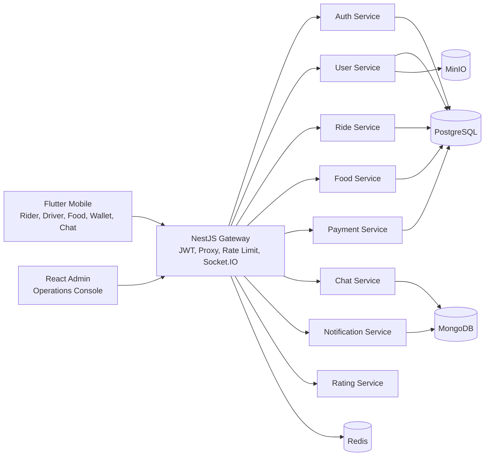

# Crab Super App Portfolio Case Study / Hồ Sơ Portfolio Crab Super App

Crab is a production-like full-stack portfolio project for a Vietnam-first
super app: ride-hailing, food delivery, wallet, chat, notifications, ratings,
and admin operations in one monorepo.

Crab là dự án portfolio full-stack theo hướng production-like cho một super app
Việt Nam: gọi xe, giao đồ ăn, ví, chat, thông báo, đánh giá và vận hành admin
trong một monorepo.

## Executive Summary / Tóm Tắt Điều Hành

| Area | English | Tiếng Việt |
| --- | --- | --- |
| Product | Consumer super app with Flutter mobile and React admin operations | Super app người dùng với Flutter mobile và bảng vận hành React |
| Backend | NestJS microservices behind a gateway with REST and Socket.IO | NestJS microservices phía sau gateway, dùng REST và Socket.IO |
| Data | PostgreSQL, MongoDB, Redis, MinIO | PostgreSQL, MongoDB, Redis, MinIO |
| Delivery | Local Docker production-like demo, CI, scanners, SBOM-ready release flow | Demo local Docker theo hướng production-like, CI, scanner và release flow sẵn sàng SBOM |
| Portfolio Proof | Real screenshots, GIF walkthrough, E2E, load tests, security audit | Screenshot thật, GIF walkthrough, E2E, load test và security audit |

The project is intentionally scoped as a local production-like portfolio demo,
not a real public cloud launch. Real SMS, real payment gateways, real FCM, app
store release, and public cloud URLs are outside this portfolio scope.

Dự án được định nghĩa là demo portfolio production-like chạy local, không phải
launch cloud thật. SMS thật, cổng thanh toán thật, FCM thật, app store release
và URL cloud public không nằm trong phạm vi portfolio này.

## Product Story / Câu Chuyện Sản Phẩm

Crab takes the familiar daily-utility pattern of apps like Grab and Be as a
category reference, while keeping its own visual identity and implementation.
The app focuses on fast decisions: book a ride, order food, check wallet trust
signals, chat with a driver, receive notifications, and rate completed work.

Crab lấy cảm hứng từ nhóm sản phẩm tiện ích hằng ngày như Grab và Be ở cấp độ
category, nhưng không copy logo, palette hoặc asset độc quyền. Trọng tâm UX là
ra quyết định nhanh: đặt xe, gọi món, kiểm tra ví, chat với tài xế, nhận thông
báo và đánh giá sau khi hoàn tất.

### What A Reviewer Should See / Người Review Nên Thấy Gì

| Signal | English | Tiếng Việt |
| --- | --- | --- |
| Breadth | Mobile, admin, backend, Docker, docs, tests | Mobile, admin, backend, Docker, docs, test |
| Depth | Domain flows continue beyond static screens | Luồng nghiệp vụ đi xa hơn các màn hình tĩnh |
| Reliability | Repeatable local commands validate the demo | Có command local lặp lại được để kiểm chứng demo |
| Craft | Screenshots and docs present a coherent product | Screenshot và docs kể một câu chuyện sản phẩm nhất quán |

## First-Look Gallery / Gallery Nhìn Nhanh

| Mobile Home | Ride Booking | Food Discovery |
| --- | --- | --- |
|  |  |  |

| Wallet/Profile Trust | Admin Dashboard | Admin Users |
| --- | --- | --- |
|  |  |  |

| Mobile Walkthrough | Admin Walkthrough |
| --- | --- |
|  |  |

## Architecture / Kiến Trúc



English:

- The gateway is the only public API surface for the production-like local demo.
- Services own their domain data and expose health checks for Docker readiness.
- REST handles command/query flows; Socket.IO covers realtime ride, food, chat,
  and notification channels.
- Shared packages keep DTO/event contracts consistent across apps and services.

Tiếng Việt:

- Gateway là bề mặt API public duy nhất cho demo local production-like.
- Mỗi service sở hữu dữ liệu nghiệp vụ riêng và có health check cho Docker.
- REST xử lý command/query; Socket.IO xử lý realtime ride, food, chat và
  notification.
- Shared packages giữ DTO/event contract nhất quán giữa app và backend.

## Feature Matrix / Ma Trận Tính Năng

| Domain | English Capability | Năng Lực Tiếng Việt | Proof |
| --- | --- | --- | --- |
| Auth | Seeded admin, rider, driver, merchant login | Login demo cho admin, rider, driver, merchant | `pnpm run test:e2e` |
| Ride | Fare estimate, request, driver accept, active ride, lifecycle, history | Ước tính giá, đặt xe, tài xế nhận, chuyến đang chạy, lifecycle, lịch sử | `test:e2e`, `tests/load/ride-flow.js` |
| Food | Restaurant discovery, menu, order creation, status progression, stats | Tìm nhà hàng, menu, tạo order, chuyển trạng thái, thống kê | `test:e2e`, `tests/load/order-flow.js` |
| Wallet | Balance, top-up, transactions | Số dư, nạp ví, lịch sử giao dịch | `test:e2e` |
| Chat | Room creation, message send/list, read state | Tạo phòng, gửi/list tin nhắn, trạng thái đã đọc | `test:e2e` |
| Notifications | Create, list, unread count, mark read, mark all read | Tạo, list, đếm chưa đọc, đánh dấu đã đọc | `test:e2e` |
| Ratings | Create rating, reference lookup, aggregate, rater lookup | Tạo rating, lookup theo reference, aggregate, lookup theo người đánh giá | `test:e2e` |
| Admin | Dashboard and operations tables for users, drivers, rides, orders | Dashboard và bảng vận hành users, drivers, rides, orders | Screenshots and web build |

## Local Demo Path / Luồng Demo Local

Run from the repository root:

```bash
corepack enable
pnpm install --frozen-lockfile
docker compose --env-file .env.production.example -f docker-compose.prod.yml up -d
pnpm run db:migrate
pnpm run db:seed
pnpm run test:e2e
pnpm run test:load
pnpm run verify:portfolio
```

Demo accounts:

| Role | Email | Password |
| --- | --- | --- |
| Admin | `admin@crab.app` | `Admin123!` |
| Rider | `rider@crab.app` | `User123!` |
| Driver | `driver@crab.app` | `Driver123!` |
| Merchant | `merchant@crab.app` | `User123!` |

English:

- Use these accounts only with seeded local/demo data.
- Do not use real customer information, real payment data, or real provider
  credentials in portfolio screenshots.

Tiếng Việt:

- Chỉ dùng các tài khoản này với dữ liệu local/demo đã seed.
- Không đưa thông tin khách hàng thật, dữ liệu thanh toán thật hoặc provider
  credential thật vào screenshot portfolio.

## Public Artifact Strategy / Chiến Lược Artifact Public

English:

- Source packages stay private because this is an application monorepo, not a
  reusable npm or pub.dev library.
- Docker Hub remains the canonical external runtime registry:
  `nguyenson1710/crab-mobile-<service>`.
- GitHub Packages is populated through GHCR for portfolio visibility:
  `ghcr.io/jasontm17/crab-mobile-<service>`.
- GitHub Releases carry semantic release notes and source snapshots.
- Mobile APK/AAB/IPA outputs are generated locally or in release pipelines and
  are never committed to the repository.

Tiếng Việt:

- Source package giữ private vì đây là monorepo ứng dụng, không phải thư viện
  npm hoặc pub.dev để tái sử dụng public.
- Docker Hub là external runtime registry chính:
  `nguyenson1710/crab-mobile-<service>`.
- GitHub Packages được populate qua GHCR để portfolio hiển thị package ngay trên
  GitHub: `ghcr.io/jasontm17/crab-mobile-<service>`.
- GitHub Releases chứa release notes theo semver và source snapshot.
- APK/AAB/IPA mobile được tạo local hoặc trong release pipeline, không commit
  vào repository.

## Validation Evidence / Bằng Chứng Kiểm Chứng

Latest validated gates for the portfolio pass:

| Gate | Status | What It Proves |
| --- | --- | --- |
| `pnpm run package:check` | Pass | Package metadata, Docker namespace, release-media guardrails |
| `pnpm run contract:check` | Pass | REST/OpenAPI/shared contract drift guardrails |
| `pnpm run test:e2e` | Pass | Gateway-backed domain journey coverage |
| `pnpm run test:load` | Pass | k6 gateway baseline load check |
| `k6 run tests/load/ride-flow.js` | Pass | Ride path under local demo concurrency |
| `k6 run tests/load/order-flow.js` | Pass | Food order path under local demo concurrency |
| `pnpm run security:audit` | Pass | Dependency audit with no known vulnerabilities |
| `pnpm run verify:portfolio` | Pass | Package, contract, admin build, mobile analyze/test, Docker config |

The E2E suite validates gateway health, all seeded role logins, protected-route
rejection, rider profile and addresses, wallet top-up and transaction history,
food order lifecycle, ride lifecycle, ratings, notifications, and chat.

Bộ E2E kiểm tra gateway health, login đủ các role demo, chặn route cần auth khi
không có token, profile/address, top-up ví và transaction history, lifecycle của
food order, lifecycle của ride, rating, notification và chat.

## Repository Self-Review Scorecard / Bảng Tự Chấm Điểm Repo

Overall score: **90 / 100**.

Điểm tổng quan: **90 / 100**.

This score is a portfolio-readiness review, not a formal production compliance
audit. It is based on current repository evidence, repeatable commands, release
media, and documented scope boundaries.

Điểm này là đánh giá mức sẵn sàng portfolio, không phải chứng nhận compliance
production chính thức. Điểm dựa trên bằng chứng trong repo, command có thể chạy
lặp lại, release media và phạm vi đã được tài liệu hóa.

| Category | Score | Evidence | Gap | Next Improvement |
| --- | ---: | --- | --- | --- |
| Documentation & portfolio presentation / Tài liệu & trình bày portfolio | 19 / 20 | README, docs index, case study, screenshots gallery, bilingual narrative | Some older domain docs are still mostly English | Gradually make core domain docs bilingual too |
| Mobile UI/UX and release media / UI/UX mobile & release media | 13 / 15 | Flutter screenshots, mobile GIF, UI/UX redesign guide, screenshot tests | Not a real app-store build/release | Add signed release artifacts and device captures for a real release track |
| Backend architecture and API contracts / Kiến trúc backend & API contract | 14 / 15 | Gateway, NestJS services, OpenAPI, contract checks, service docs | Some provider integrations are demo/local only | Add real provider adapters behind explicit environment flags |
| E2E, load, and mobile validation / E2E, load test & mobile validation | 19 / 20 | `test:e2e`, k6 baseline, ride/order load flows, `verify:portfolio`, Flutter analyze/test | Load profile is local-demo sized, not stress-test sized | Add a separate stress profile with throttling/infra expectations |
| Security posture / Tư thế bảo mật | 8 / 10 | `security:audit`, secret hygiene, ignored env files, gateway auth guardrails | No external penetration test or runtime scanner evidence | Add scheduled Trivy/CodeQL evidence and threat-model report snapshots |
| DevOps and release readiness / DevOps & sẵn sàng release | 9 / 10 | Docker Compose prod config, image namespace guardrails, CI/CD docs, release checklist | No public cloud deployment target in scope | Add optional Render/VPS/K8s deployment walkthrough with sanitized secrets |
| Git and repo hygiene / Git & vệ sinh repo | 8 / 10 | Monorepo structure, package guardrails, ignored temp artifacts, documented scripts | Current portfolio pass is a large changeset | Keep future changes smaller with feature branches and focused commits |

Reviewer interpretation:

- **90+**: strong full-stack portfolio project; suitable for interview/demo use.
- **80-89**: useful portfolio, but likely missing verification or media polish.
- **Below 80**: needs clearer docs, stronger tests, or cleaner release evidence.

Cách đọc điểm:

- **90+**: portfolio full-stack mạnh, phù hợp dùng để phỏng vấn/demo.
- **80-89**: portfolio dùng được nhưng còn thiếu kiểm chứng hoặc media polish.
- **Dưới 80**: cần làm rõ docs, tăng test hoặc làm sạch bằng chứng release.

## UI/UX Direction / Định Hướng UI/UX

English:

- Mobile should feel energetic and trustworthy, with green as the brand anchor,
  amber for rewards/promos, and restrained blue/teal for trust/status moments.
- Admin should stay denser, calmer, and operations-focused: tables, filters,
  status tags, and repeatable workflows matter more than marketing visuals.
- Screenshots must show populated success states, not placeholder loading
  screens or debug artifacts.

Tiếng Việt:

- Mobile cần năng động nhưng đáng tin cậy: xanh làm màu nhận diện chính, amber
  cho reward/promo, blue/teal chỉ dùng cho trạng thái hoặc cảm giác tin cậy.
- Admin cần gọn, rõ và phục vụ vận hành: bảng dữ liệu, filter, status tag và
  workflow lặp lại quan trọng hơn hiệu ứng marketing.
- Screenshot public phải là trạng thái thành công có dữ liệu, không dùng loading
  placeholder hoặc debug artifact.

## Repository Reading Path / Lộ Trình Đọc Repo

| Step | Document | Why |
| --- | --- | --- |
| 1 | [README](../README.md) | Quick product and repository overview |
| 2 | [Documentation Index](./INDEX.md) | Find architecture, API, deployment, testing, and domain docs |
| 3 | [Quickstart](./QUICKSTART.md) | Run the stack locally |
| 4 | [Architecture](./ARCHITECTURE.md) | Understand service boundaries and data flow |
| 5 | [API Reference](./API.md) | Review REST contracts |
| 6 | [Mobile Guide](./MOBILE.md) | Understand Flutter architecture and UX surfaces |
| 7 | [Screenshots Gallery](./screenshots/README.md) | Review release media |
| 8 | [Testing Guide](./TESTING.md) | Verify quality gates and load tests |

## Interview Talking Points / Điểm Nói Khi Phỏng Vấn

English:

- Why the gateway owns public entry while services keep domain boundaries.
- How seeded demo data makes portfolio validation repeatable.
- Why local Docker was chosen over a public cloud requirement for this portfolio.
- How contract checks and E2E tests prevent docs from becoming marketing claims.
- What would change for a real launch: real providers, observability dashboards,
  secret management, incident process, app-store signing, and cloud deployment.

Tiếng Việt:

- Vì sao gateway là entry public, còn service giữ boundary nghiệp vụ riêng.
- Cách seed data giúp demo portfolio chạy lặp lại và kiểm chứng được.
- Vì sao portfolio chọn local Docker thay vì bắt buộc cloud public.
- Cách contract check và E2E test giúp docs không chỉ là lời quảng cáo.
- Nếu launch thật cần bổ sung gì: provider thật, observability dashboard, quản
  lý secret, incident process, ký app-store và cloud deployment.

## Current Portfolio Boundaries / Ranh Giới Portfolio Hiện Tại

In scope:

- Full-stack local demo.
- Flutter client surfaces and release media.
- React admin operations dashboard.
- NestJS gateway and backend services.
- Docker Compose production-like configuration.
- Repeatable validation, E2E, load, and security audit commands.

Out of scope:

- Real SMS/OTP provider.
- Real payment gateway settlement.
- Real FCM production push.
- Public cloud URL.
- App Store / Play Store release.
- Compliance certification.

## Screenshot Quality Checklist / Checklist Chất Lượng Screenshot

- Use seeded non-sensitive demo data.
- Show success states with meaningful content.
- Avoid stack traces, 404 pages, debug banners, raw loading screens, and real
  credentials.
- Keep filenames stable under `docs/screenshots/`.
- Keep temporary proof/current/emulator captures ignored and out of public docs.

- Dùng dữ liệu demo không nhạy cảm.
- Ưu tiên trạng thái thành công có nội dung rõ.
- Tránh stack trace, 404, debug banner, loading thô và credential thật.
- Giữ tên file ổn định trong `docs/screenshots/`.
- File proof/current/emulator chỉ để local và không đưa vào public docs.

## References / Tài Liệu Liên Quan

- [Documentation Index](./INDEX.md)
- [Screenshots Gallery](./screenshots/README.md)
- [Mobile UI/UX Redesign](./MOBILE_UI_UX_REDESIGN.md)
- [Testing Guide](./TESTING.md)
- [Deployment Guide](./DEPLOYMENT.md)
- [Security Policy](../SECURITY.md)
