# Screenshots Gallery / Thư Viện Ảnh

This gallery contains curated release-facing screenshots for Crab Super App. Use only stable, scrubbed images in public documentation.

Thư viện này chứa ảnh đã chọn lọc cho tài liệu public của Crab Super App. Chỉ dùng ảnh ổn định, đã kiểm tra không lộ dữ liệu nhạy cảm.

For a polished bilingual portfolio narrative that uses these assets, see
[Portfolio Case Study](../PORTFOLIO_CASE_STUDY.md).

Để xem bản hồ sơ portfolio song ngữ dùng bộ ảnh này, xem
[Portfolio Case Study](../PORTFOLIO_CASE_STUDY.md).

## Web Admin / Giao Diện Admin

The admin gallery shows populated operations screens: login, dashboard, users, drivers, rides, orders, and responsive mobile viewport checks.

Bộ ảnh admin thể hiện các màn vận hành có dữ liệu: đăng nhập, dashboard, users, drivers, rides, orders và kiểm tra responsive mobile viewport.

| Screen | Preview | Notes |
| --- | --- | --- |
| Login | 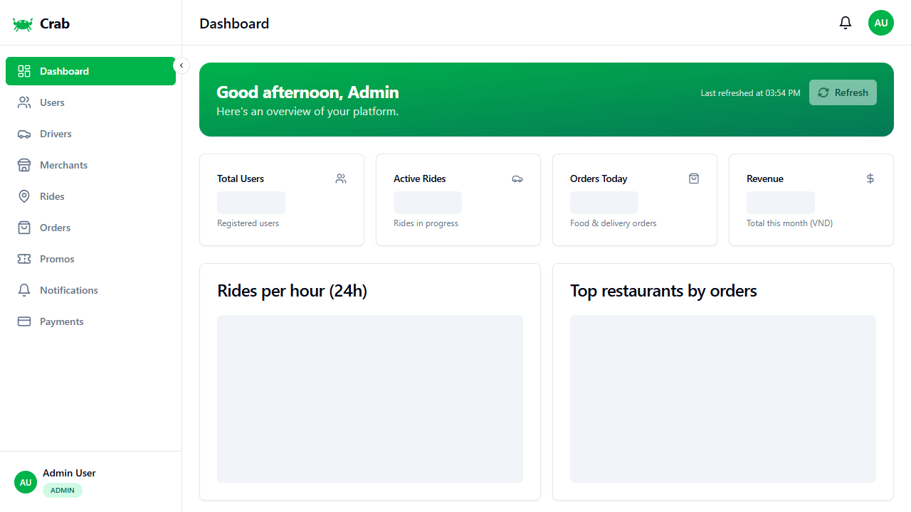 | Phone/email login form with JWT auth flow |
| Dashboard |  | KPI cards, charts, and navigation |
| Users |  | Paginated user operations table |
| Drivers | 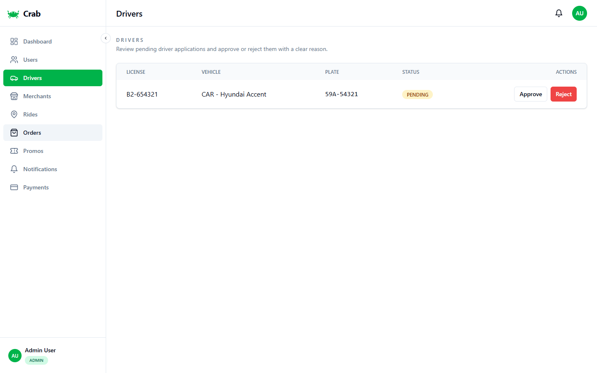 | Driver verification and vehicle details |
| Rides | 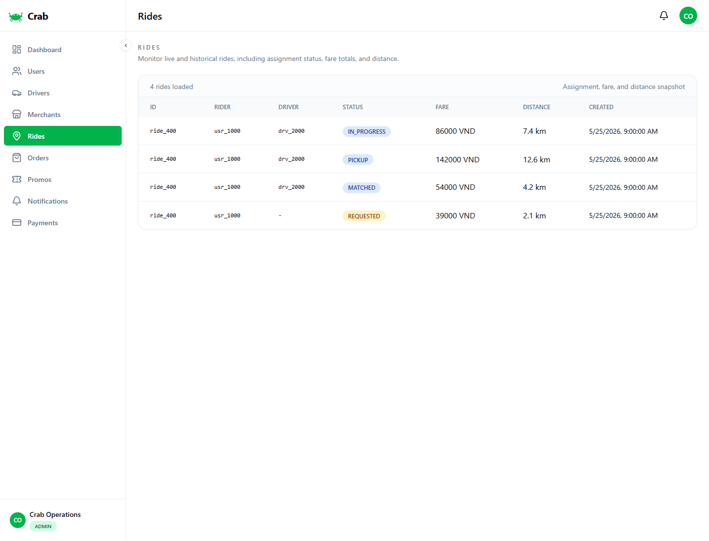 | Ride monitoring with status/fare/distance |
| Orders | 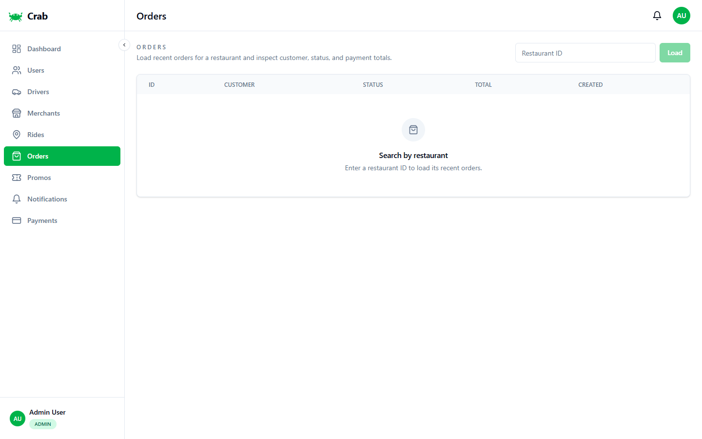 | Food order monitoring and status timeline |
| Dashboard final | 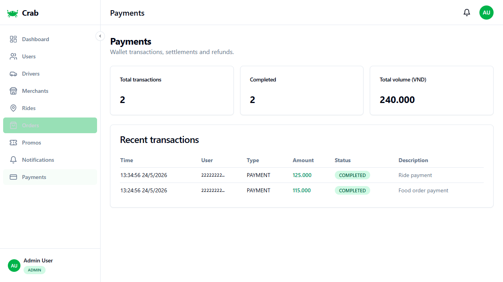 | Re-captured dashboard after navigation smoke test |

## Web Admin Responsive / Admin Trên Mobile Viewport

| Screen | Preview |
| --- | --- |
| Dashboard | 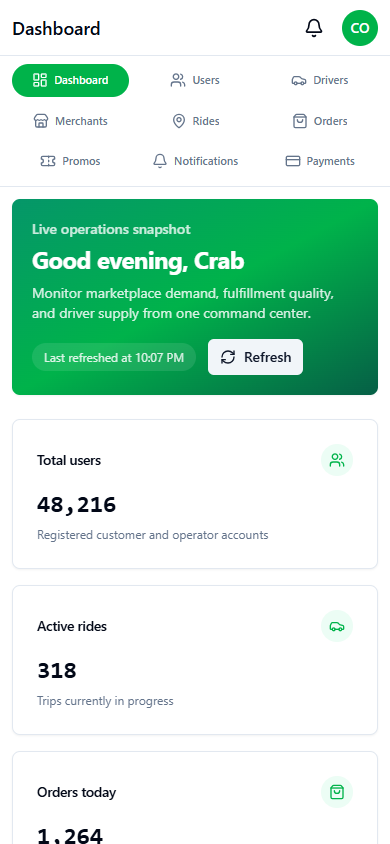 |
| Login |  |
| Users | 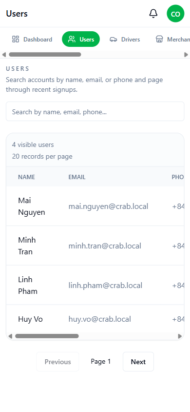 |
| Drivers | 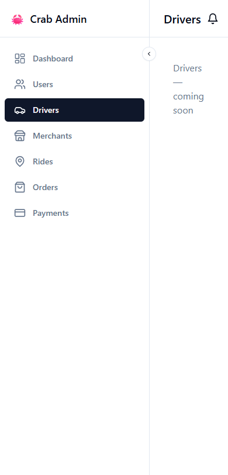 |
| Rides | 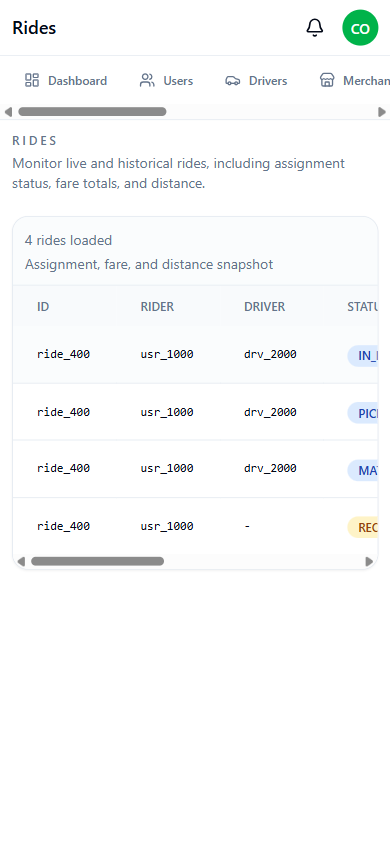 |
| Orders | 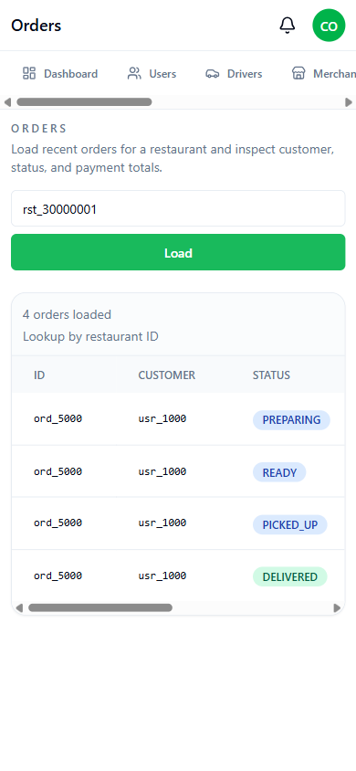 |

## Mobile Client / Ứng Dụng Client

The mobile gallery must show real user-facing Flutter screens: onboarding, login, and signed-in home. These captures are release media, not proof/current/emulator scratch files.

Gallery mobile phải thể hiện màn Flutter dành cho user thật: onboarding, login và home sau đăng nhập. Đây là ảnh release, không phải proof/current/emulator scratch.

The full mobile UI/UX refresh plan and capture quality gate live in [Mobile UI/UX Redesign](../MOBILE_UI_UX_REDESIGN.md).

Portfolio media should tell a short product story: onboarding, login, signed-in home, one core ride or food flow, and one trust surface such as wallet or profile. The final target GIF is `docs/gifs/mobile-client-flow.gif`.

Refresh the current mobile release screenshots with:

```bash
pnpm run mobile:screenshots
```

| Screen | Preview | Notes |
| --- | --- | --- |
| Onboarding | 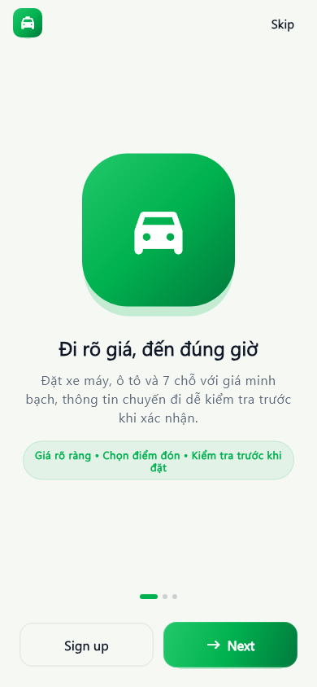 | Verified Flutter onboarding screenshot from the current widget tree |
| Login | 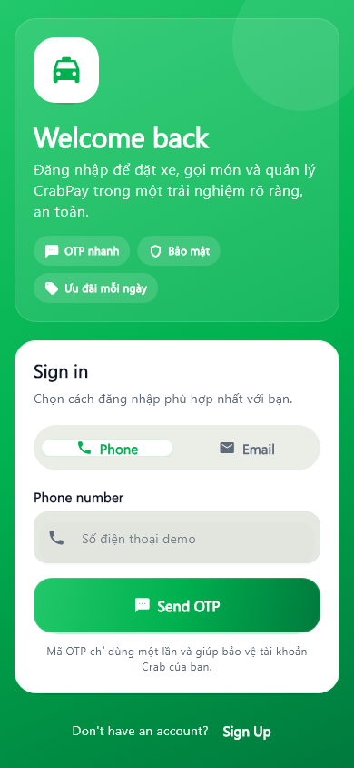 | Real user auth screen with phone/email entry |
| Signed-in home |  | Real user home surface with services, wallet, and promos |
| Ride booking |  | Stitch-guided booking sheet with route, fare, ETA, vehicle choice, and CTA |
| Food discovery |  | Stitch-guided restaurant discovery with categories, ratings, ETA, and delivery fee |
| Wallet/profile trust |  | Wallet balance, transaction history, and trust cues for the seeded demo account |

## GIFs / Ảnh Động

| Asset | Preview | Notes |
| --- | --- | --- |
| Admin release flow |  | Login to dashboard and core operations walkthrough |
| Mobile client flow |  | Onboarding, auth, home, ride, food, and wallet portfolio walkthrough |

## Capture Checklist / Checklist Khi Chụp Ảnh

- Use seeded, non-sensitive demo data.
- Wait for loading states to settle before capture.
- Do not capture 404 pages, raw stack traces, real credentials, real addresses, real phone numbers, tokens, or payment details.
- Prefer success states with populated tables/cards.
- Put release-facing images under `docs/screenshots/` with stable names such as `admin-*.png`, `admin-mobile-*.png`, or `mobile-*.png`.
- Keep temporary proof/current/emulator captures local-only and do not reference them from public docs.

- Dùng dữ liệu demo không nhạy cảm.
- Chờ màn hình load xong trước khi chụp.
- Không chụp 404, stack trace, credentials thật, địa chỉ thật, số điện thoại thật, token hoặc thông tin thanh toán.
- Ưu tiên trạng thái thành công có dữ liệu.
- Ảnh public đặt dưới `docs/screenshots/` với tên ổn định như `admin-*.png`, `admin-mobile-*.png` hoặc `mobile-*.png`.
- Proof/current/emulator captures chỉ dùng local, không reference trong public docs.
